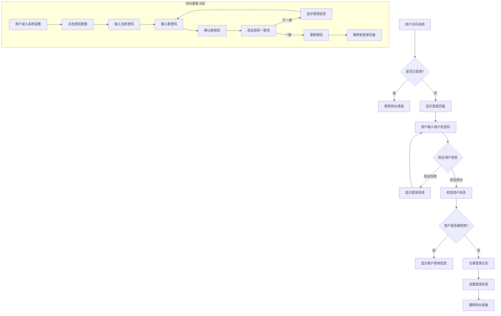
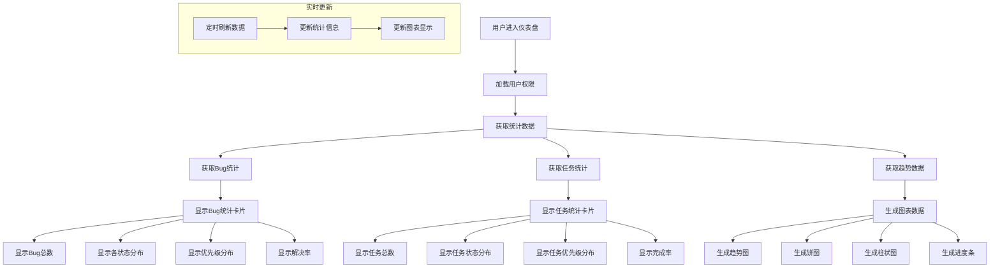
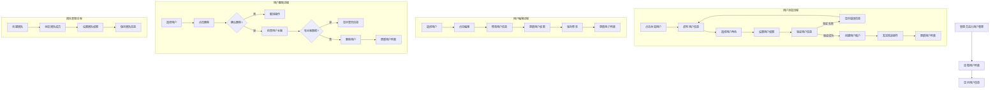
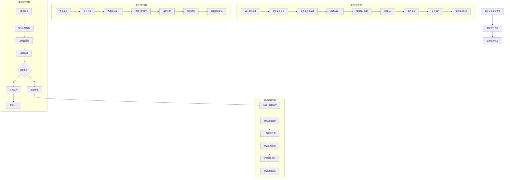
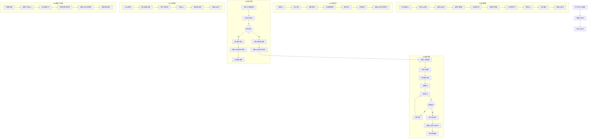
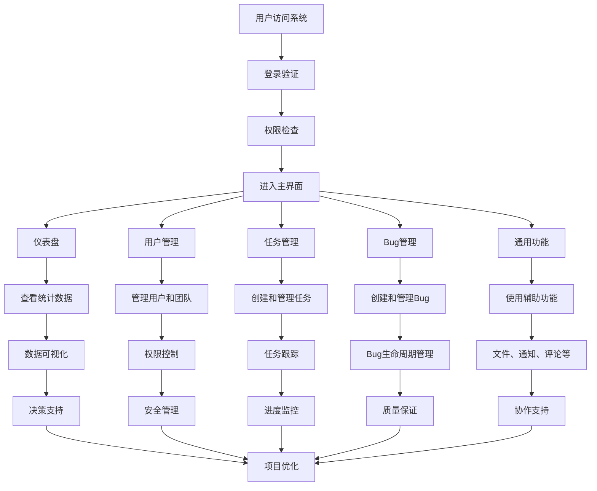
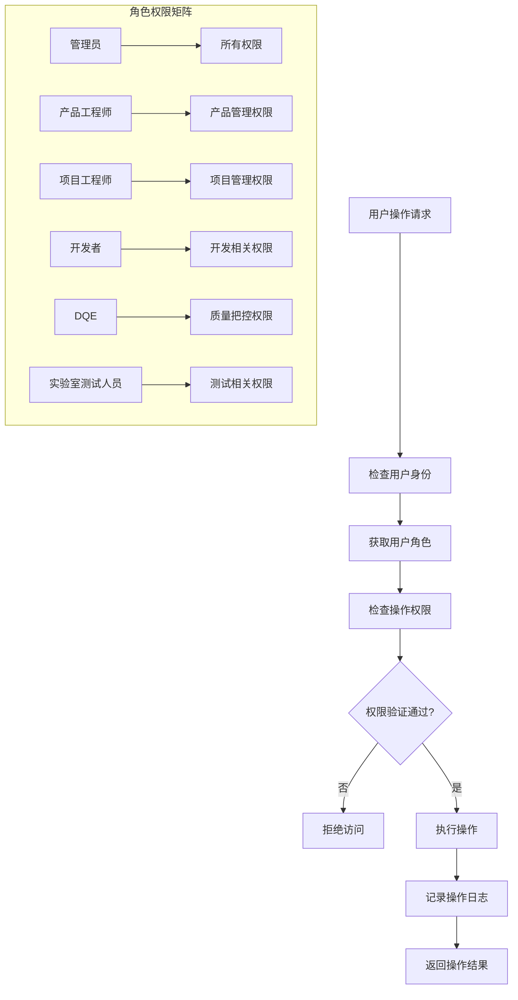
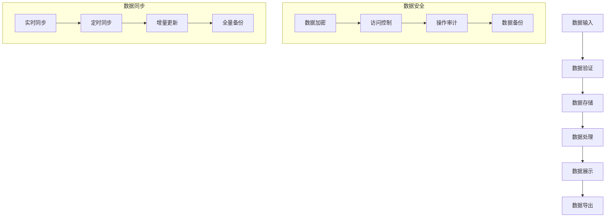
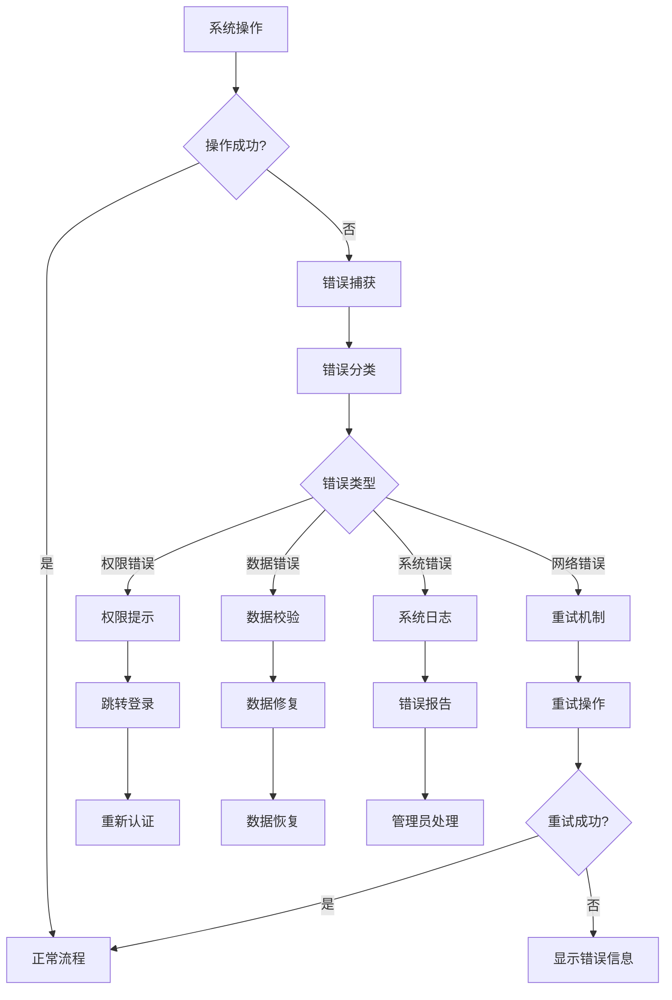

# Bug管理系统 - 流程图文档

## 1. 登录模块流程图



## 2. 仪表盘模块流程图



## 3. 用户管理模块流程图



## 4. 任务管理模块流程图



## 5. Bug管理模块流程图



## 6. 通用功能模块流程图

```mermaid
flowchart TD
    A[用户使用通用功能] --> B{选择功能类型}
    
    subgraph 文件管理流程
        B -->|文件上传| C[选择文件]
        C --> D[验证文件格式]
        D --> E{格式支持?}
        E -->|否| F[显示错误信息]
        E -->|是| G[检查文件大小]
        G --> H{大小超限?}
        H -->|是| I[显示大小限制信息]
        H -->|否| J[上传文件]
        J --> K[保存文件信息]
        K --> L[返回文件链接]
    end
    
    subgraph 通知系统流程
        B -->|发送通知| M[选择通知类型]
        M --> N[填写通知内容]
        N --> O[选择接收人]
        O --> P[发送通知]
        P --> Q[记录通知日志]
        Q --> R[更新通知状态]
    end
    
    subgraph 评论功能流程
        B -->|发表评论| S[选择评论对象]
        S --> T[输入评论内容]
        T --> U[@用户提醒]
        U --> V[发布评论]
        V --> W[发送评论通知]
        W --> X[更新评论列表]
    end
    
    subgraph 数据导出流程
        B -->|导出数据| Y[选择导出类型]
        Y --> Z[设置导出条件]
        Z --> AA[选择导出格式]
        AA --> BB[生成导出文件]
        BB --> CC[下载文件]
        CC --> DD[记录导出日志]
    end
    
    subgraph 搜索功能流程
        B -->|搜索| EE[输入搜索关键词]
        EE --> FF[选择搜索范围]
        FF --> GG[执行搜索]
        GG --> HH[显示搜索结果]
        HH --> II[提供高级筛选]
    end
```

## 7. 系统整体流程图



## 8. 权限控制流程图



## 9. 数据流转流程图



## 10. 错误处理流程图



---

**说明：**
1. 所有流程图使用Mermaid语法编写，可在支持Mermaid的平台上直接渲染
2. 流程图涵盖了系统的主要业务流程和异常处理
3. 每个模块的流程都考虑了权限控制和数据安全
4. 流程图可根据实际开发需求进行调整和优化 